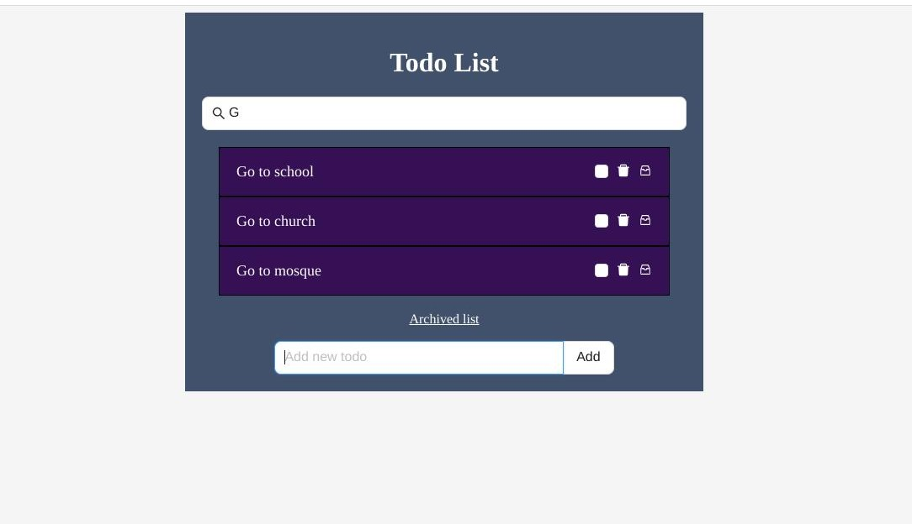

# Desupervised test

This is a basic CRUD Todo application with not so fancy UI



## Prerequisites

Before you start, make sure you have the following tools installed on your machine:

- Docker: [Install Docker](https://docs.docker.com/get-docker/)
- Docker Compose: [Install Docker Compose](https://docs.docker.com/compose/install/)

## Environment Variables

To run this project, you will need to add the necessary environment variables to the .env file located in the server directory

NB: all the required environment variables can be found in the .env.example file

## Getting Started

To set up the application on your local host, follow these steps:

1.) Clone the repository:

```bash
  git clone https://github.com/believemanasseh/desupervised-test.git
```

2.) Navigate to the project (server) directory. This would enable Docker read from the .env file without issues:

```bash
  cd desupervised-test/server
```

3.) Build and start the application using Docker Compose:

```bash
  docker-compose build && docker-compose up --no-deps -d
```

4.) Access the application:

Once the containers are up and running, you can access the application in your web browser at http://localhost:5173. You can also access the server-side app at http://localhost:8000

5.) Stop the application:

To stop the application and remove the containers, run the following command in the project directory:

```bash
  docker-compose down --remove-orphans --volumes
```

## Additional Info

The client-side files are located in the client directory.
The server-side files are located in the server directory.
The application uses Docker to provide a consistent and isolated environment.

## Summary

This was mostly an interesting project for me. I was able to implement the basic functionalities as instructed such as user authentication, CRUD functionality for todo items (including archiving and also marking tasks as completed) and search functionality. If I had more time, I would have optimized the server-side app by including proper API responses, middlewares, unit/integration tests and better security. Also, the client-side app needs some work in terms of responsiveness for various screen sizes :)

I made sure to implement all the necessary features because I felt it would give the app a better user experience. While it was fun to build, it didn't come without challenges. I mostly ran into issues setting up Docker for the client-side app (which was scaffolded using Vite.js). I wasn't aware Vite required a special config in the `vite.config.ts` file for the Docker container port mapping to work properly. However, I was able to resolve in the end after hours of debugging via trial and error.
